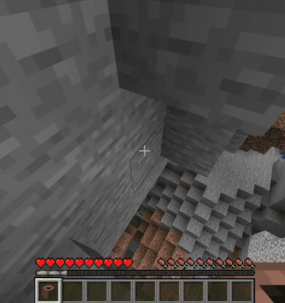
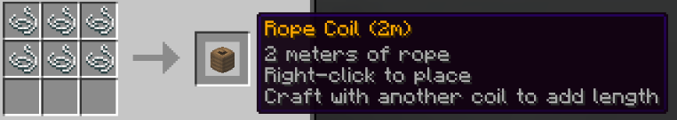
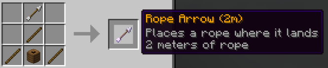
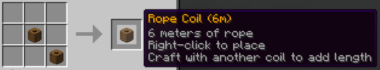

# Ropes

A Minecraft Paper plugin that lets you place, shoot, and climb ropes. Get it on [Modrinth](https://modrinth.com/project/ropes).

# Features

- **Rope Coils** - Craftable items that place vertical ropes when used on blocks
- **Rope Arrows** - Shoot ropes from a bow to place them at a distance
- **Climbing** - Jump to climb ropes, sneak to descend

| Rope Coil | Rope Arrow |
|:-:|:-:|
|  |  |
| *Placing a rope coil* | *Shooting a rope arrow* |

## Rope Coils

Right-click with a rope coil to place a rope hanging downward, as long as there is a block above for the rope to attach to. The rope extends down until it hits an obstacle or runs out of length. You can also place a rope on a fence post if there is space for the rope below it. To extend an existing rope, right-click it with another rope coil.

## Rope Arrows

Shoot a rope arrow from a bow to place a rope at a distance. The rope will attach where the arrow lands.

## Climbing

- **Jump/Spacebar** to start climbing
- **Sprint and move** to continue climbing or change direction to up when moving down
- **Hold sneak** to descend

### Breaking Ropes

Left-click a rope to break it and receive rope coils back. Breaking the anchor block at the top destroys the entire rope.

## Crafting

| Recipe | Description |
|:-:|:--|
|  | *Craft a Rope Coil with  6 string, unshaped. Resulting rope coil length is configurable.* |
|  | *Craft a Rope Arrow by combining a Rope Coil with an arrow and sticks.* |
|  | *Combine two Rope Coils to add their lengths together (up to 16 blocks, configurable).* |

# Installation

Download the latest release from [Modrinth](https://modrinth.com/project/ropes), and place the JAR file in your server's `plugins` folder. Restart the server.

## Commands

| Command                             | Description                                             |
| ----------------------------------- | ------------------------------------------------------- |
| `/ropes help`                       | Show available commands                                 |
| `/ropes info`                       | Display rope statistics across all loaded chunks        |
| `/ropes give {coil,arrow} [length]` | Give yourself a rope item (OP)                          |
| `/ropes recipes [player]`           | Unlock rope recipes for yourself or another player (OP) |
| `/ropes reload`                     | Reload configuration (OP)                               |
| `/ropes delete_all confirm`         | Remove all placed ropes (OP)                            |

## Configuration

Key options in `config.yml`:

- `rope-coil.default-length` - Default rope length when crafting (default: 2)
- `rope-coil.max-length` - Maximum length per coil (default: 16)
- `rope-block.climb-speed` - How fast players climb (default: 0.2)
- `recipes.rope-coil.enabled` - Enable/disable rope coil crafting
- `recipes.rope-arrow.enabled` - Enable/disable rope arrow crafting
- `recipes.unlock-on-advancement` - Advancement that unlocks rope recipes (default: `minecraft:adventure/ol_betsy`). Set to empty string to disable.

Recipe changes require a server restart to take effect.

